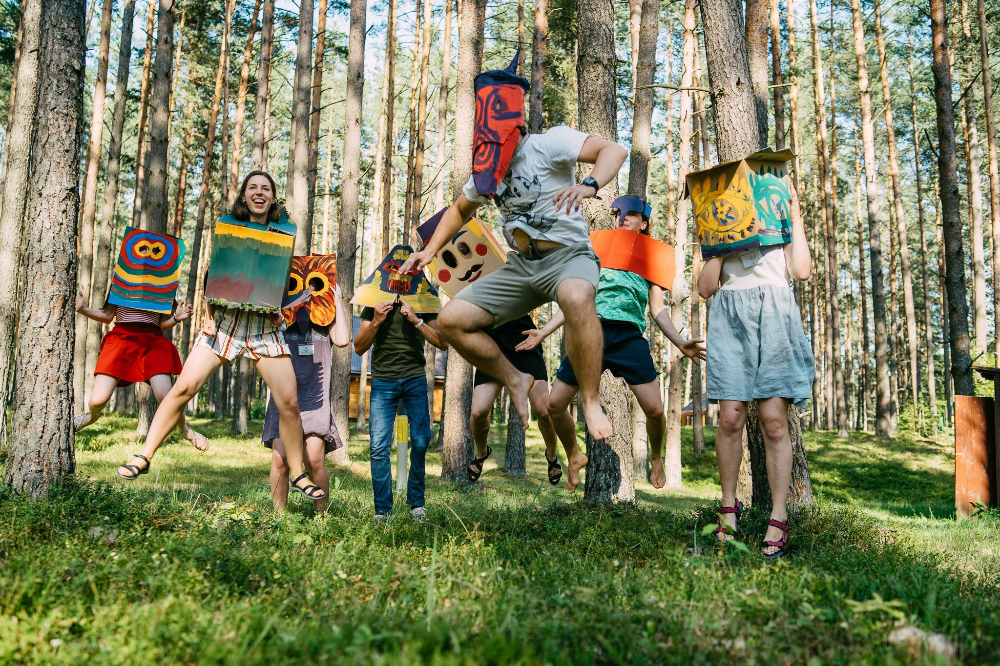

# What is AleksaBurn? 🔥

AleksaBurn is the whimsical result of an aging individual who has an upcoming 30th birthday and no other event in sight to use as reason to congregate 
her spectacular friends all in one location. You are invited to gather in Latvia to celebrate another year around the sun in the style of my pagan ancestors. 

## RSVP/ Expression of Interest (FOMO is real!) 🤩

Please fill out this webform to RSVP. Even if you are not 100% sure, we are trying to estimate a participant count, so your latest thoughts are welcome! 

[https://forms.gle/QjCaYRixroroPMdK8](https://forms.gle/QjCaYRixroroPMdK8)

## Save the Date 🎉

Please block your calendars for **July 29-31 (Friday-Sunday)**. Meeting point in **Riga, Latvia**. 

The majority of the activities will take place in **Latgale** (approx. 3 hours outside of Riga), but transport here will be organized. 

Transport back to Riga will be organized for Monday morning. (But get in touch if you want to leave earlier, and we can help plan - there are lots of buses, trains, and other options!)

You are welcome to come earlier and/or stay longer, but these 3 days will include a program of activities, rituals, merrymaking, creative expression, and time to chill. I will be taking time off before and after to hang with you all in Riga or other parts of Latvia :)

## Event Details 🛶

Event details, program, and precise location & accommodation –> **TBD** and will be shared as participant numbers are confirmed. 

The super high-level agenda: 

**Friday** 
Welcome! 
Transport to Birķeneļi
Fun! Music! Fire! All the things! 

**Saturday** 
Chilling and surprises!
Fun! Music! Raving!

**Sunday** 
Chilling
Adventure afternoon in Aglona! 
(Optional Travel Back to Riga if flying out early Monday)
Travel back to Birķeneļi
Fun! Music! Fire! All the things! 

Activities may include: 
- Bonfires
- Burns 
- Flower crown-making
- Naked sauna time & herb-whacking (I'm not joking.)
- Canoes
- Forest walks & mushroom foraging
- Music 
- Dancing & DFMOs
- Libations
- Gentle peer pressure
- Hanging with some of the greatest humans you'll ever meet (hint: that includes you!)

## Guiding Principles 👯

These principles are guidelines for how we together can create a magical weekend experience. 

**1. Radical Inclusion:** We welcome and respect friends and unfamiliar faces from all parts of the world, so please come with an open mind and heart. If you want to bring a significant other or friend, they are welcome–just let us know! 

**2. Participation:** Everyone is invited to play. We believe that an incredible weekend experience can occur only through the medium of deeply personal participation. While consent must come first, we welcome active participation in planned events.  

**3. Friendship:** There are good ships and wood ships, ships that sail the sea, but the best ships are friendships, may they always be!

**4. Vaccination:** Please make sure you have your Covid-19 vaccination. Enough said. 

## Travel ✈️

Riga International Airport (RIX) is located just outside the capital city, and can be easily reached via a number of airline routes that often have layovers in other European countries. 
[Check out flights!](https://www.google.com/search?q=google+flights+riga&oq=google+flights+riga)

Additional details/guidance to be provided. 

## Stay in Touch 😘

Join the [AleksaBurn Whatsapp group](https://chat.whatsapp.com/BZMOTAZ3jgiFiVe3ArxQPK) for receiving regular updates and asking questions.  

## Photos to Inspire ✨

